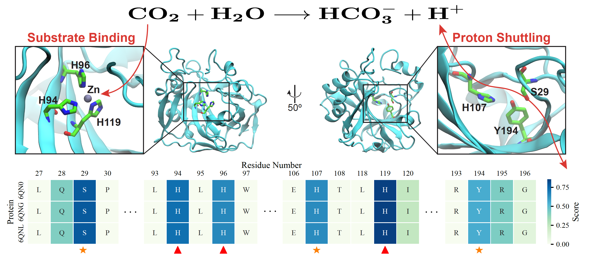
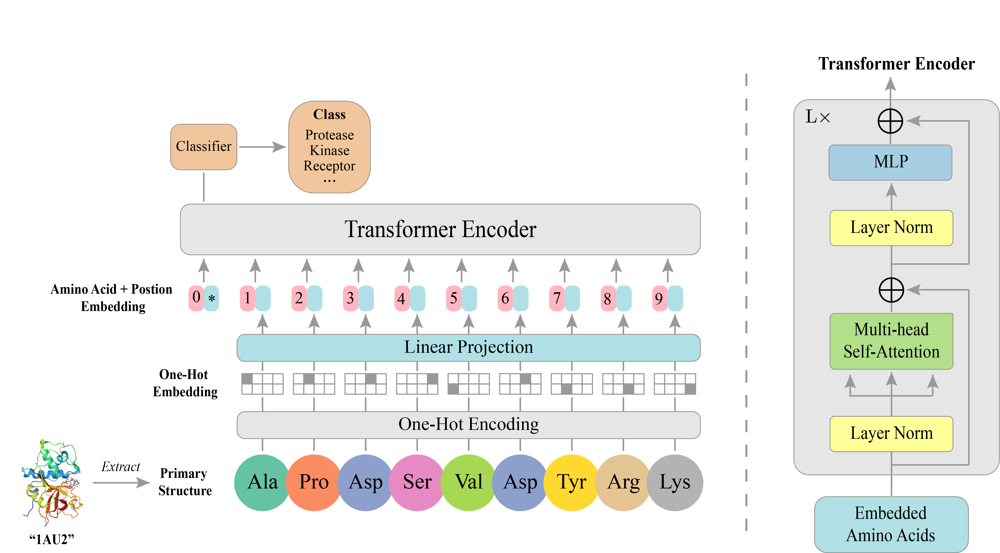

# Do Protein Transformers Have Biological Intelligence?



Figure 1: Illustration of two key protein motifs, i.e., `His94-His96-His119`and `Ser29-His107-Tyr194`, identified by our approach.


Deep neural networks, particularly Transformers, have been widely adopted for predicting the functional properties of proteins. In this work, we focus on exploring whether Protein Transformers can capture biological intelligence among protein sequences. To achieve our goal, we first introduce a protein function dataset, namely **Protein-FN**, providing over 9000 protein data with meaningful labels. Second, we devise a new Transformer architecture, namely **Sequence Protein Transformers (SPT)**, for computationally efficient protein function predictions. Third, we develop a novel Explainable Artificial Intelligence (XAI) technique called **Sequence Score**, which can efficiently interpret the decision-making processes of protein models, thereby overcoming the difficulty of deciphering biological intelligence bided in Protein Transformers. Remarkably, even our smallest SPT-Tiny model, which contains only 5.4M parameters, demonstrates impressive predictive accuracy, achieving 94.3% on the Antibiotic Resistance (AR) dataset and 99.6% on the Protein-FN dataset, all accomplished by training from scratch. Besides, our Sequence Score technique helps reveal that our SPT models can discover several meaningful patterns underlying the sequence structures of protein data, with these patterns aligning closely with the domain knowledge in the biology community.


## The Protein-FN Dataset

Table 1: Overview of our protein function (Protein-FN) dataset

|    Class     | Protease | Kinase | Receptor | Carbonic Anhydrase | Phosphatase | Isomerase | Total |
| :----------: | :------: | :----: | :------: | :----------------: | :---------: | :-------: | ----- |
| **#Sample** |   3067   |  2502  |   1437   |        1206        |     431     |    371    | 9014  |

This section introduces our protein function (**Protein-FN**) dataset, designed specifically for such biological tasks as protein function prediction, motif identification and discovery, etc. The above table provides an overview of our Protein-FN dataset. This dataset, sourced from the Protein Data Bank (PDB), provides diverse 1D amino acid sequences, 3D protein structures, functional properties of 9014 proteins. These proteins, after carefully examined by biological experts in our team, fall into six categories, i.e., protease, kinase, receptor, carbonic anhydrase, phosphatase, and isomerase. Notably, kinases, phosphatases, proteases, and receptors play essential roles in signal transduction. Most drugs act on proteins involved in signal transduction. Isomerases and carbonic anhydrases are two enzymes that are not directly involved in signal transduction pathways, but they catalyze critical reactions. We have officially released our Protein-FN dataset on Hugging Face Datasets https://huggingface.co/datasets/Protein-FN/Protein-FN.

​	
## Sequence Protein Transformers (SPT)




Our proposed Sequence Protein Transformers (SPT) model consists of a stack of Transformer Encoders, and each of which comprises a Multi-head Self-Attention (MSA) block and an MLP block. Both of them incorporate a Layer Normalization before the block and a residual connection after the block. Different from prior Transformer variants the input sequence for our SPT model (i.e., a chain of amino acid embeddings)  is obtained by linearly projecting the one-hot embedding of the protein's primary structure. Specifically, three model variants, i.e., SPT-Tiny, SPT-Small, and SPT-Base, are developed, tailored for protein function predictions across different scales of data. All SPT variants are composed of 12 layers of Transformer blocks, with their hidden sizes set to 192, 384, and 768, and their number of heads set to 4, 6, and 12, respectively for the SPT-Tiny, the SPT-Small, and the SPT-Base models. The MLP sizes are consistently set to be four times of their corresponding hidden sizes. The following  table lists the details of each model variant.


## Requirements

- torch == 1.13.0
- torchvision == 0.14.0
- numpy == 1.26.0
- pandas == 2.0.3
- argparse == 1.4.0
- timm == 0.5.4
- scipy == 1.11.3
- biopandas == 0.4.1
- grad-cam == 1.4.8
- tensorboard == 2.13.0
- einops == 0.7.0

You can use the following instructions to install all the requirements:
```
pip install -r requirements.txt
```


## Experiments

- **The Protein-FN Dataset**

To reproduce our experiments, please download our Protein-FN dataset from [HuggingFace Datasets](https://huggingface.co/datasets/Protein-FN/Protein-FN), and then move the dataset to a directory, e.g., `/mnt/data/protein`. After that, you can train the SPT model via the following command:

```shell
# train the SPT-Tiny model
python main_finetune_spt.py --data_root /mnt/data/protein/data --model spt_tiny_embed192
```


- **The Antibiotic Resistance (AR) and the Metal Ion Binding (MIB) Datasets**

To reproduce our experiments on the AR and MIB datasets, please use the following command:

```shell
# train the SPT-Tiny model on the AR dataset
python main_finetune_spt_benchmarks.py --data_root ./data/Antibiotic\ Resistance --model spt_tiny_embed192 --max_seq 1024 --nb_classes 19
```


## License

This repository is under the CC-BY-NC 4.0 license. Please refer to the [LICENSE](LICENSE)  file for details.
